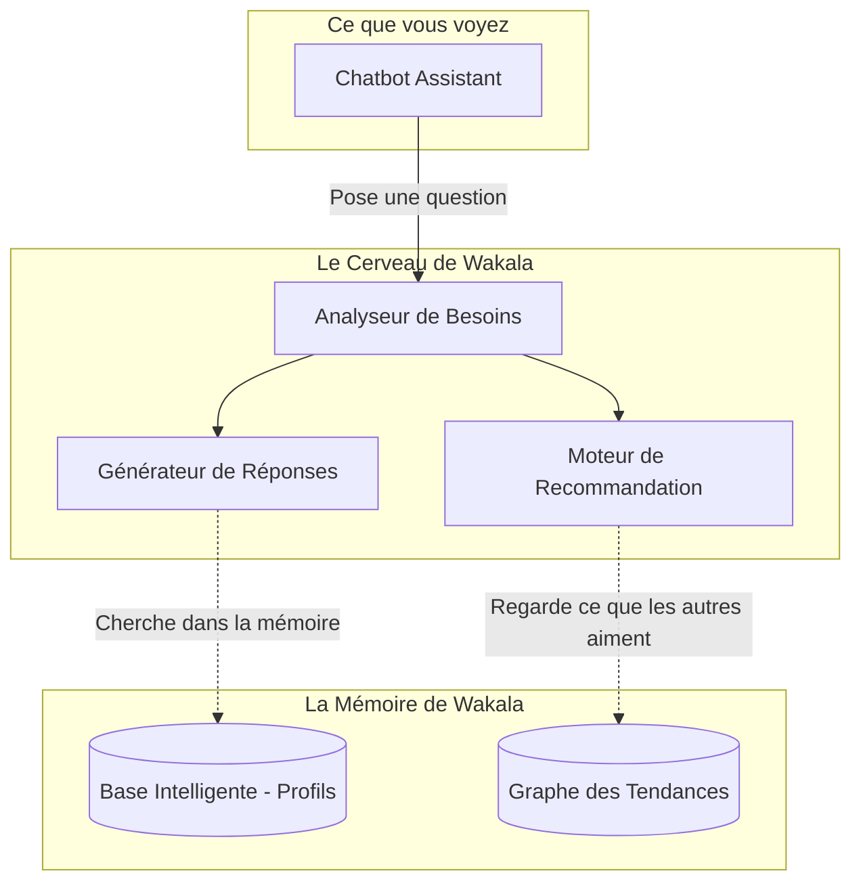

# 🏗️ Architecture Fonctionnelle de Wakala

> **Note** : Ce document explique le fonctionnement de Wakala en termes simples. Il traduit la complexité technologique en valeur directe pour l'utilisateur.

---

## 1. Vue d'Ensemble du Système (Macro-Architecture)

Wakala n'est pas un simple catalogue de voitures. C'est un **assistant personnel intelligent**. Au lieu de vous laisser cliquer sur des dizaines de filtres, Wakala vous écoute, vous comprend et trouve pour vous. 
Tout repose sur deux piliers principaux :
1. **Le Chatbot IA** : C'est le conseiller qui discute avec vous de manière naturelle.
2. **Le Moteur de Recommandation** : C'est l'expert qui connaît tout le stock et trouve la perle rare.

---

## 2. Le Parcours d'une Annonce (Comment on remplit le garage)

Pour vous proposer les meilleures voitures, Wakala doit d'abord les trouver. 

**En termes simples :**
Chaque jour, nos robots scrutent les sites d'annonces automobiles marocains. Ils lisent les annonces, corrigent les fautes d'orthographe (par exemple, ils comprennent que "Merco" veut dire "Mercedes"), et rangent toutes ces voitures de manière parfaitement propre dans notre base de données. 

---

## 3. Le Chatbot IA (Votre Conseiller Virtuel)

Quand l'utilisateur tape `"Je cherche une citadine pas chère pour jeune permis"`, une recherche classique ne trouverait rien (car aucune voiture n'a la marque "jeune permis"). 

**Comment Wakala résout ça étape par étape :**
1. **Écoute (L'accueil)** : Le Chatbot lit votre phrase.
2. **Compréhension (Analyseur de texte)** : Une intelligence artificielle traduit votre phrase en critères concrets. Elle comprend que "jeune permis" signifie petite voiture, assurance peu coûteuse, et "pas chère" signifie budget limité à l'achat et à l'entretien.
3. **Dialogue Actif** : Si votre demande est trop vague, le Chatbot vous pose des questions simples : *"Faites-vous plutôt de l'autoroute ou de la ville ?"*. 
4. **Réponse (Le conseil)** : Le Chatbot cherche dans notre base de données les véhicules qui correspondent à ces critères cachés et vous les présente en vous expliquant exactement *pourquoi* ce sont de bons choix pour votre profil spécifique.

---

## 4. Le Moteur de Recommandation (L'Expert)

Notre Moteur de Recommandation fonctionne un peu comme Netflix, mais pour les voitures. Il ne se contente pas de vous donner ce que vous avez demandé ; il anticipe ce que vous allez aimer.

**Comment ça marche ?**
- **Apprentissage des goûts (Graphes de tendances)** : Le moteur observe de manière anonyme ce que les utilisateurs aiment. S'il remarque que beaucoup de personnes qui cherchaient une "voiture familiale" ont fini par acheter une "Dacia Lodgy", il apprend cette tendance.
- **Profilage Mathématique** : Chaque voiture et chaque acheteur sont transformés en profils mathématiques. Le moteur calcule la "ressemblance" entre votre profil et les voitures disponibles.
- **La Recommandation (La magie)** : Si vous venez nous dire que vous avez une grande famille, le Moteur de Recommandation va croiser vos critères stricts (budget, 7 places) avec les tendances d'autres familles. Il vous suggérera le Dacia Lodgy, mais peut-être aussi un ludospace économique auquel vous n'aviez pas pensé, créant ainsi un effet de belle surprise.

Wakala agit ainsi non pas comme un simple moteur de recherche, mais comme un véritable **entremetteur automobile**. Il connaît chaque véhicule sur le bout des doigts et trouve celui qui correspond parfaitement à votre style de vie.

