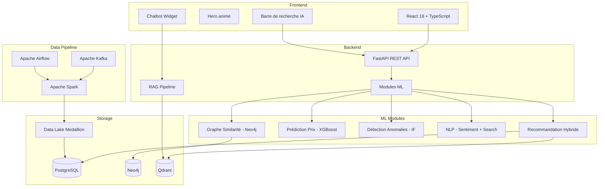

# 🏗️ Architecture Wakala

## Vue d'ensemble



## Architecture Medallion

| Couche   | Format  | Contenu                           |
|----------|---------|-----------------------------------|
| Bronze   | JSON    | Données brutes depuis Kafka       |
| Silver   | Parquet | Données nettoyées, typées         |
| Gold     | Parquet | Agrégations, features pour ML     |

## Flux de données

1. **Ingestion** : Sources d'annonces → Kafka → Bronze
2. **Transformation** : Spark Streaming → Silver (temps réel)
3. **Agrégation** : Spark Batch (Airflow) → Gold
4. **ML Training** : Gold → XGBoost, Isolation Forest, Embeddings
5. **Serving** : FastAPI expose les prédictions en temps réel
6. **RAG** : Qdrant + LangChain → Chatbot contextuel

## Zoom sur l'Architecture du Moteur de Recommandation

Inspirée des systèmes décisionnels classiques, l'architecture du moteur de recommandation se divise en 5 piliers :

```mermaid
flowchart LR
    classDef col fill:#f9f9f9,stroke:#333,stroke-width:2px;
    classDef db fill:#00a2ed,stroke:#000,stroke-width:1px,color:#fff;
    classDef process fill:#fff,stroke:#333,stroke-width:1px;
    classDef output fill:#fff,stroke:#333,stroke-width:1px;
    
    %% 1. Sources de Données
    subgraph SD [1. Sources de données]
        direction TB
        S1[(Bases Opérationnelles\nAnnonces Scrapées)]:::db
        S2[Sources Externes\nDonnées Constructeurs]:::process
        S3[Inputs Utilisateur\nProfils Chatbot]:::process
    end

    %% 2. Pipeline ETL
    subgraph ETL [2. Pipeline ETL]
        direction TB
        P1[Extraire \n(Scraping)]:::process
        P2[Nettoyer \n(Doublons, prix)]:::process
        P3[Transformer \n(Embeddings)]:::process
        P4[Charger \n(Rafraîchissement)]:::process
        P1 ~~~ P2 ~~~ P3 ~~~ P4
    end

    %% 3. Sources de Stockage
    subgraph SS [3. Sources de Stockage]
        direction TB
        MD[Méta-données\n(Poids des algos)]:::process
        ED[(Entrepôt Vectoriel\nStockage Embeddings)]:::db
        MD --> ED
        MD1[(Magasin\nDétails Annonces)]:::db
        MD2[(Magasin\nProfils Clients)]:::db
        MD3[(Magasin\nHistorique)]:::db
        ED --> MD1
        ED --> MD2
        ED --> MD3
    end

    %% 4. Moteur d'Analyse
    subgraph MA [4. Moteur d'analyse IA]
        direction TB
        OLAP1[Serveur Similarité\n(Recherche k-NN)]:::process
        OLAP2[Serveur Ranking\n(Pondération)]:::process
    end

    %% 5. Outils en Sortie
    subgraph OS [5. Outils en sortie]
        direction TB
        R1[API Recommandations\n(Top N Voitures)]:::output
        R2[Justifications IA\n(Argumentaire)]:::output
        R3[Data Mining\n(Analytics)]:::output
    end

    %% Connexions
    SD == "Ingestion" ==> ETL
    ETL == "Flux Transformé" ==> SS
    SS == "Requêtes" ==> MA
    MA == "Servir" ==> OS
```
