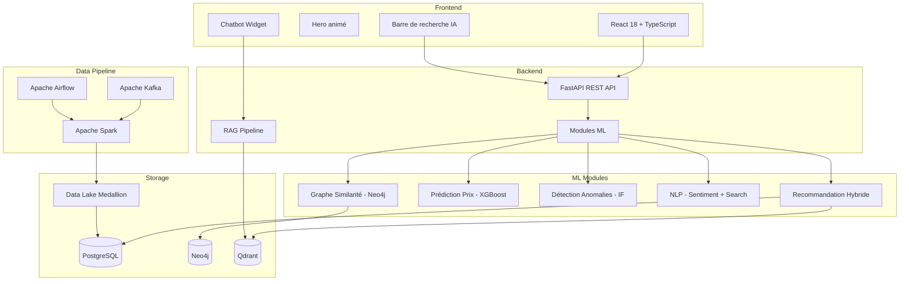

# 🏗️ Architecture Wakala

## Vue d'ensemble

## Architecture Medallion

| Couche   | Format  | Contenu                           |
|----------|---------|-----------------------------------|
| Bronze   | JSON    | Données brutes depuis Kafka       |
| Silver   | Parquet | Données nettoyées, typées         |
| Gold     | Parquet | Agrégations, features pour ML     |

## Flux de données

1. **Ingestion** : Sources d'annonces → Kafka → Bronze
2. **Transformation** : Spark Streaming → Silver (temps réel)
3. **Agrégation** : Spark Batch (Airflow) → Gold
4. **ML Training** : Gold → XGBoost, Isolation Forest, Embeddings
5. **Serving** : FastAPI expose les prédictions en temps réel
6. **RAG** : Qdrant + LangChain → Chatbot contextuel
