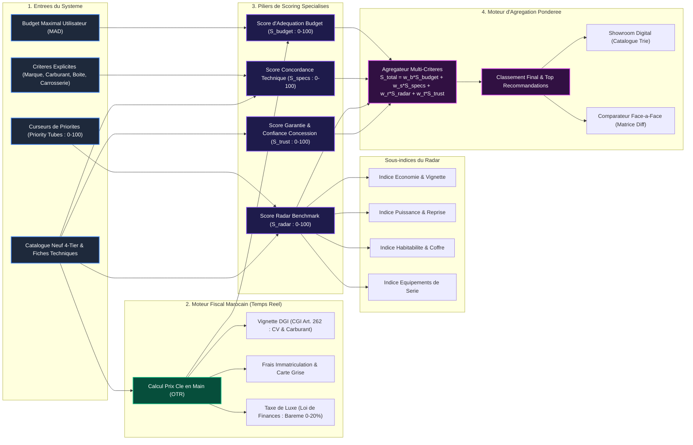

# Moteur de Scoring Hybride — Wakala

```mermaid
flowchart LR
    classDef inputBlock fill:#1e293b,stroke:#3b82f6,stroke-width:2px,color:#ffffff;
    classDef engineBlock fill:#1e1b4b,stroke:#8b5cf6,stroke-width:2px,color:#ffffff;
    classDef calcBlock fill:#064e3b,stroke:#10b981,stroke-width:2px,color:#ffffff;
    classDef finalBlock fill:#311042,stroke:#d946ef,stroke-width:2px,color:#ffffff;

    subgraph INPUTS["1. Entrees du Systeme"]
        U1["Criteres Explicites (Marque, Carburant, Boite, Carrosserie)"]:::inputBlock
        U2["Curseurs de Priorites (Priority Tubes : 0-100)"]:::inputBlock
        U3["Budget Maximal Utilisateur (MAD)"]:::inputBlock
        DB["Catalogue Neuf 4-Tier & Fiches Techniques"]:::inputBlock
    end

    subgraph TAX_ENGINE["2. Moteur Fiscal Marocain (Temps Reel)"]
        DB --> T1["Calcul Prix Cle en Main (OTR)"]:::calcBlock
        T1 --> T2["Vignette DGI (CGI Art. 262 : CV & Carburant)"]
        T1 --> T3["Frais Immatriculation & Carte Grise"]
        T1 --> T4["Taxe de Luxe (Loi de Finances : Bareme 0-20%)"]
    end

    subgraph SCORING_PILLARS["3. Piliers de Scoring Specialises"]
        U3 --> P1["Score d'Adequation Budget (S_budget : 0-100)"]:::engineBlock
        T1 --> P1
        U1 --> P2["Score Concordance Technique (S_specs : 0-100)"]:::engineBlock
        DB --> P2
        U2 --> P3["Score Radar Benchmark (S_radar : 0-100)"]:::engineBlock
        DB --> P3
        DB --> P4["Score Garantie & Confiance Concession (S_trust : 0-100)"]:::engineBlock
    end

    subgraph RADAR_DETAILS["Sous-indices du Radar"]
        P3 --> R1["Indice Economie & Vignette"]
        P3 --> R2["Indice Puissance & Reprise"]
        P3 --> R3["Indice Habitabilite & Coffre"]
        P3 --> R4["Indice Equipements de Serie"]
    end

    subgraph AGGREGATION["4. Moteur d'Agregation Ponderee"]
        P1 --> AGG["Agregateur Multi-Criteres<br/>S_total = w_b*S_budget + w_s*S_specs + w_r*S_radar + w_t*S_trust"]:::finalBlock
        P2 --> AGG
        P3 --> AGG
        P4 --> AGG
        
        AGG --> RANK["Classement Final & Top Recommandations"]:::finalBlock
        RANK --> OUT1["Showroom Digital (Catalogue Trie)"]
        RANK --> OUT2["Comparateur Face-a-Face (Matrice Diff)"]
    end
```
