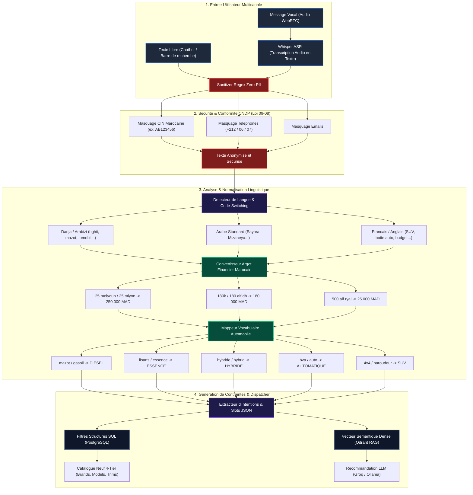

# Pipeline NLP Multilingue (FR / AR / Darija / Arabizi) — Wakala

```mermaid
flowchart TD
    classDef inputNode fill:#1e293b,stroke:#3b82f6,stroke-width:2px,color:#ffffff;
    classDef piiNode fill:#7f1d1d,stroke:#ef4444,stroke-width:2px,color:#ffffff;
    classDef nlpNode fill:#1e1b4b,stroke:#8b5cf6,stroke-width:2px,color:#ffffff;
    classDef normNode fill:#064e3b,stroke:#10b981,stroke-width:2px,color:#ffffff;
    classDef queryNode fill:#0f172a,stroke:#64748b,stroke-width:2px,color:#ffffff;

    subgraph INGRESS["1. Entree Utilisateur Multicanale"]
        A1["Texte Libre (Chatbot / Barre de recherche)"]:::inputNode
        A2["Message Vocal (Audio WebRTC)"]:::inputNode
        A3["Whisper ASR (Transcription Audio en Texte)"]:::inputNode
        A2 --> A3
        A1 --> B
        A3 --> B
    end

    subgraph PII_SECURITY["2. Securite & Conformite CNDP (Loi 09-08)"]
        B["Sanitizer Regex Zero-PII"]:::piiNode
        B1["Masquage CIN Marocaine (ex: AB123456)"]
        B2["Masquage Telephones (+212 / 06 / 07)"]
        B3["Masquage Emails"]
        B --> B1
        B --> B2
        B --> B3
        B1 --> C["Texte Anonymise et Securise"]:::piiNode
        B2 --> C
        B3 --> C
    end

    subgraph MOROCCAN_NLP["3. Analyse & Normalisation Linguistique"]
        C --> D["Detecteur de Langue & Code-Switching"]:::nlpNode
        D --> D1["Darija / Arabizi (bghit, mazot, tomobil...)"]
        D --> D2["Arabe Standard (Sayara, Mizaneya...)"]
        D --> D3["Francais / Anglais (SUV, boite auto, budget...)"]
        
        D1 --> E["Convertisseur Argot Financier Marocain"]:::normNode
        D2 --> E
        D3 --> E
        
        E --> E1["25 melyoun / 25 mlyon -> 250 000 MAD"]
        E --> E2["180k / 180 alf dh -> 180 000 MAD"]
        E --> E3["500 alf ryal -> 25 000 MAD"]
        
        E1 --> F["Mappeur Vocabulaire Automobile"]:::normNode
        E2 --> F
        E3 --> F
        
        F --> F1["mazot / gasoil -> DIESEL"]
        F --> F2["lisans / essence -> ESSENCE"]
        F --> F3["hybride / hybrid -> HYBRIDE"]
        F --> F4["bva / auto -> AUTOMATIQUE"]
        F --> F5["4x4 / baroudeur -> SUV"]
    end

    subgraph OUTPUT_DISPATCH["4. Generation de Contraintes & Dispatcher"]
        F1 --> G["Extracteur d'Intentions & Slots JSON"]:::nlpNode
        F2 --> G
        F3 --> G
        F4 --> G
        F5 --> G
        
        G --> H1["Filtres Structures SQL (PostgreSQL)"]:::queryNode
        G --> H2["Vecteur Semantique Dense (Qdrant RAG)"]:::queryNode
        
        H1 --> I["Catalogue Neuf 4-Tier (Brands, Models, Trims)"]
        H2 --> J["Recommandation LLM (Groq / Ollama)"]
    end
```
